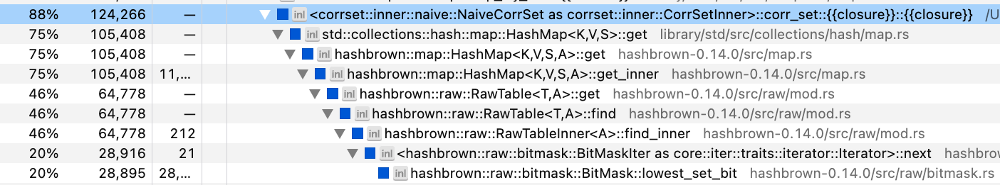
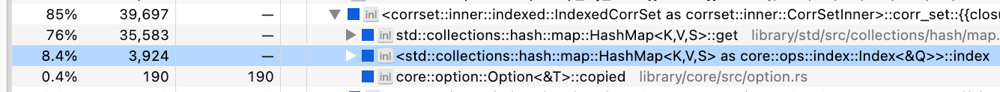
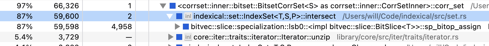
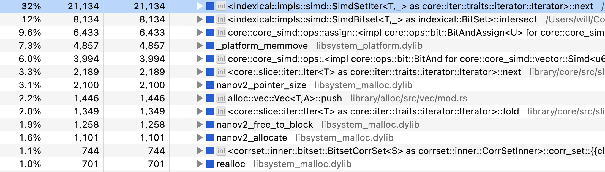
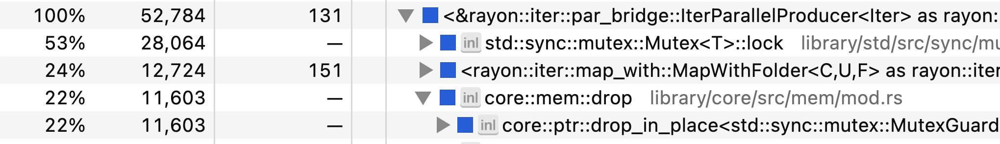
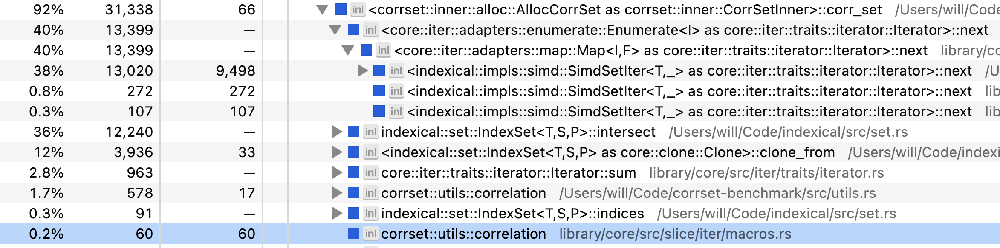

This note documents one of my recent adventures in performance optimization with Rust. 
By following along, hopefully you'll learn something about how to write fast Rust.

Here's the context: imagine you have data from an online exam where a set of users answered a set of questions. The raw data looks like this:

```js
[
  {
    "user": "5ea2c2e3-4dc8-4a5a-93ec-18d3d9197374",
    "question": "7d42b17d-77ff-4e0a-9a4d-354ddd7bbc57",
    "score": 1
  },
  {
    "user": "b7746016-fdbf-4f8a-9f84-05fde7b9c07a",
    "question": "7d42b17d-77ff-4e0a-9a4d-354ddd7bbc57",
    "score": 0
  },  
  /* ... more data ... */
]
```

Note that each user only answered a subset of all possible questions, and all scores are either 0 or 1.

Here's the problem: given a size $k$, which set of $k$ questions has the highest correlation with overall performance? We'll call this the **k-CorrSet problem**. A simple brute-force algorithm for solving the k-CorrSet problem looks like this pseudocode:

```text
func k_corrset($data, $k):
  $all_qs = all questions in $data
  for all $k-sized subsets $qs within $all_qs:
    $us = all users that answered every question in $qs
    $qs_totals = the total score on $qs of each user in $us
    $grand_totals = the grand score on $all_qs of each user in $us
    $r = correlation($qs_totals, $grand_totals)
  return $qs with maximum $r    
```

We are going to implement several variations on this algorithm to see how fast we can make it.


## Python Baseline

When I do data analysis, I usually start with Python and then transition to Rust when I need better speed or memory consumption.
So as a baseline, let's look at a straightforward [Pandas] program for solving k-CorrSet:

```python
from itertools import combinations
import pandas as pd
from pandas import IndexSlice as islice

def k_corrset(data, K):
    all_qs = data.question.unique()
    q_to_score = data.set_index(['question', 'user'])
    all_grand_totals = data.groupby('user').score.sum().rename('grand_total')

    corrs = []
    for qs in combinations(all_qs, K):
        qs_data = q_to_score.loc[islice[qs,:],:].swaplevel()
        answered_all = qs_data.groupby(level=[0]).size() == K
        answered_all = answered_all[answered_all].index
        qs_totals = qs_data.loc[islice[answered_all,:]] \
            .groupby(level=[0]).sum().rename(columns={'score': 'qs'})
        r = qs_totals.join(all_grand_totals).corr().qs.grand_total
        corrs.append({'qs': qs, 'r': r})
    corrs = pd.DataFrame(corrs)

    return corrs.sort_values('r', ascending=False).iloc[0].qs

data = pd.read_json('scores.json')
print(k_corrset(data, K=5))
```

This uses a bit of [MultiIndex] magic, but don't sweat the details. 
Let's start benchmarking. First, we need data. To make the benchmark realistic, I generated
synthetic data that roughly matches the properties of my actual data. The properties of the synthetic data are:

* 60,000 users
* 200 questions
* 20% sparsity (i.e., 12,000 users answered each question)
* Each score is equally likely 1 or 0

Our goal will be to compute k-CorrSet on this dataset for k = 5 in a reasonable amount of time on my 2021 M1 Macbook Pro. 
Note that there are $\binom{200}{5}$ = 2.5 billion combinations of questions, so we need the inner loop of the brute-force algorithm to be quite fast.

Using Python's [`time.time()`] function, I computed the speed of the inner loop for 1,000 iterations running with CPython 3.9.17. 
The average execution time was **36 milliseconds**. 
Not too bad, but at this rate, the full computation would complete in **2.9 years**. Let's make that faster!

> Note: there are lots of ways we could make the Python code faster, but the point of this post isn't to compare highly-optimized Python to highly-optimized Rust.
> The point is to compare "standard-Jupyter-notebook" Python to highly-optimized Rust.

## Rust Reimplementation

We can start optimizing by reimplementing the Python code into a roughly equivalent Rust program, expecting some free speedups from Rust's compiler optimizations. 
For readability, all the code below is a simplification of the actual benchmark. For instance, I will omit `#[derive]`s on types, and I will coalesce disparate blocks of code into straight-line functions. You can see the full benchmark here: <https://github.com/willcrichton/corrset-benchmark>

First, we translate the data types:

```rust
pub struct User(pub String);

pub struct Question(pub String);

pub struct Row {
  pub user: User,
  pub question: Question,
  pub score: u32,
}
```

We make `User` and `Question` into newtypes both for clarity and so we can implement traits on them.
Then, the basic k-CorrSet algorithm is implemented as follows:


```rust
fn k_corrset(data: &[Row], k: usize) -> Vec<&Question> {
  // utils::group_by(impl Iterator<Item = (K1, K2, V)>) 
  //   -> HashMap<K1, HashMap<K2, V>>;
  let q_to_score: HashMap<&Question, HashMap<&User, u32>> = 
    utils::group_by(data.iter().map(|r| (&r.question, &r.user, r.score)));
  let u_to_score: HashMap<&User, HashMap<&Question, u32>> = 
    utils::group_by(data.iter().map(|r| (&r.user, &r.question, r.score)));
  let all_grand_totals: HashMap<&User, u32> = 
    u_to_score.iter().map(|(user, scores)| {
      let total = scores.values().sum::<u32>();
      (*user, total)
    })
    .collect();

  let all_qs = q_to_score.keys().copied();
  all_qs.combinations(k)
    .filter_map(|qs: Vec<&Question>| {
      let (qs_totals, grand_totals): (Vec<_>, Vec<_>) = all_grand_totals.iter()
        .filter_map(|(u, grand_total)| {
          let q_total = qs.iter()
            .map(|q| q_to_score[*q].get(u).copied())
            .sum::<Option<u32>>()?;
          Some((q_total as f64, *grand_total as f64))
        })
        .unzip();
      // utils::correlation(&[f64], &[f64]) -> f64;
      let r = utils::correlation(&qs_totals, &grand_totals);
      (!r.is_nan()).then_some((qs, r))
    })
    .max_by_key(|(_, r)| FloatOrd(*r))
    .unwrap().0
}
```

The key elements to understand:

* Like with Python, we convert the flat data into hierarchical data with a hashmap and the `utils::group_by` helper. 
  (Note that everywhere we refer to `HashMap` is actually an alias for [`fxhash::FxHashMap`], which is just [`std::collections::HashMap`]
  with a more efficient hashing algorithm.) 
* Then we iterate over all combinations of questions using the [`Itertools::combinations`] method.
* In the inner loop, we iterate over all users via `all_grand_totals.iter()`. 
* The expression `q_to_score[*q].get(u).copied()` has type `Option<u32>`, which is `Some(n)` if the user has a score for `q`,
  and `None` otherwise.
* The iterator method `.sum::<Option<u32>>()` returns `Some(total)` if the user answered every question in `qs`, and `None` otherwise.
* We call a helper method `utils::correlation` that implements a standard calculation for [Pearson's $r$](https://en.wikipedia.org/wiki/Pearson_correlation_coefficient).
* We use `max_by_key` to get the questions with the highest correlation. We use [`FloatOrd`] so we can compare floats.

So how's the performance? I used [Criterion] to benchmark the performance of the inner loop (the `filter_map`) with Criterion's default settings, using
the same dataset as before. The new inner loop runs in **4.2 milliseconds**, which is about 8 times faster than the Python baseline! 
But our full computation is still 124 days, which is too long. Now let's start really optimizing.


## Indexed Data

Rather than guess how to optimize the code, let's run a profiler to see where the bottleneck is. On my Mac, I usually use [Instruments.app], but
recently I tried [samply] and wow! It's much nicer to use. Samply seems to work better with Rust both in terms of symbol demangling and in terms of reconstructing 
the call stack. Here's a screenshot of the relevant part of the samply trace for the Rust implementation so far:



We're spending 75% of our time in `HashMap::get`! This is the offending line of code:

```rust
q_to_score[*q].get(u).copied()
```

The problem is that we're hashing and comparing 36-byte UUID strings, which is expensive.
We need a smaller type that can stand-in for the question/user strings.

The solution is that we will collect all the questions and users into a `Vec`, and represent
each question/user by their index in that `Vec`. We could just use `usize` indices with the `Vec` type, but a better practice is to use newtypes to represent each kind of index. In fact, this problem comes up so often in my work that I've already made a crate for it, [Indexical] (which builds on the [index_vec] crate). We define those index types like this:

```rust
pub struct QuestionRef<'a>(pub &'a Question);
pub struct UserRef<'a>(pub &'a User);

define_index_type! {
  pub struct QuestionIdx for QuestionRef<'a> = u16;
}

define_index_type! {
  pub struct UserIdx for UserRef<'a> = u32;
}
```

The `QuestionRef` and `UserRef` types are newtypes that enable us to implement traits on `&Question` and `&User`. The `define_index_type` macro creates new index types `QuestionIdx` and `UserIdx` which are associated with `QuestionRef` and `UserRef`. Those indices are represented as `u16` and a `u32`, respectively. 

Finally we update `k_corrset` to generate an [`IndexedDomain`] for questions and users, 
and then use the `QuestionIdx` and `UserIdx` types throughout the rest of the code:

```rust
fn k_corrset(data: &[Row], k: usize) -> Vec<&Question> {
  // first, we create an `IndexedDomain` for questions and users
  let (questions_set, users_set): (HashSet<_>, HashSet<_>) = data.iter()
    .map(|row| (QuestionRef(&row.question), UserRef(&row.user)))
    .unzip();
  let questions = IndexedDomain::from_iter(questions_set);
  let users = IndexedDomain::from_iter(users_set);

  // then we create the same data structures as before, 
  // except using `IndexedDomain::index` to lookup indices.
  // note the change in the HashMap key types
  let q_to_score: HashMap<QuestionIdx, HashMap<UserIdx, u32>> = 
    utils::group_by(data.iter().map(|r| (
      questions.index(&(QuestionRef(&r.question))),
      users.index(&(UserRef(&r.user))),
      r.score,
    )));
  let u_to_score: HashMap<UserIdx, HashMap<QuestionIdx, u32>> = 
    utils::group_by(data.iter().map(|r| (
      users.index(&(UserRef(&r.user))),
      questions.index(&(QuestionRef(&r.question))),
      r.score,
    )));  
  let all_grand_totals = // same code

  let all_qs = questions.indices();
  all_qs.combinations(k)
    .filter_map(|qs: Vec<QuestionIdx>| {
      // same code
    })
    .max_by_key(|(_, r)| FloatOrd(*r))
    .unwrap().0
    // we have to post-process the indices back to values
    .into_iter().map(|idx| questions.value(idx).0).collect()
}
```

Again, check out the [GitHub](https://github.com/willcrichton/corrset-benchmark/blob/main/src/inner/indexed.rs) for the complete implementation, and check out the [indexical docs][Indexical] for details on its API.

Once again we run our benchmark on the inner loop of the computation. The new inner loop runs in **1.0 milliseconds**, which is 4 times faster than our last iteration, and 35 times faster than our Python baseline. We're down to 30 days for the total computation &mdash; let's keep going!


## Indexed Collections

Let's profile again:



Blast, still spending most our time in `HashMap::get`. Well, what if we got rid of hash maps altogether? A `HashMap<&User, u32>` is conceptually the same thing as a `Vec<Option<u32>>` where each `&User` has a unique index. For example, in a domain of users `["a", "b", "c"]`, then the hash map `{"b" => 1}` is equivalent to the vector `[None, Some(1), None]`. This vector costs more memory (paying for the `None` spaces), but it improves the performance of key/value lookups (avoids hashing).

We're trying to fully optimize for performance, and given the scale of our dataset, we can afford to make the compute/memory trade-off. We will use Indexical which provides a [`DenseIndexMap<K, V>`][`DenseIndexMap`] type that is internally implemented as a `Vec<V>` type indexed by `K::Index`.

The main change to the `k_corrset` function is that we convert all our auxiliary data structures to dense index maps:

```rust
pub type QuestionMap<'a, T> = DenseIndexMap<'a, QuestionRef<'a>, T>;
pub type UserMap<'a, T> = DenseIndexMap<'a, UserRef<'a>, T>;

fn k_corrset(data: &[Row], k: usize) -> Vec<&Question> {
  // build the `users` and `questions` domains same as before

  // Initialize q_to_score to an empty dense map
  let mut q_to_score: QuestionMap<'_, UserMap<'_, Option<u32>>> = 
    QuestionMap::new(&questions, |_| UserMap::new(&users, |_| None));  

  // Fill in q_to_score with the dataset
  for r in data {
    q_to_score
      .get_mut(&QuestionRef(&r.question))
      .unwrap()
      .insert(UserRef(&r.user), Some(r.score));
  }

  let grand_totals = UserMap::new(&users, |u| {
    q_to_score.values().filter_map(|v| v[u]).sum::<u32>()
  });

  let all_qs = questions.indices();
  all_qs.combinations(k)
    // almost the same code, see below
}
```

The only change to the inner loop is that our code which used to say this:

```rust
q_to_score[*q].get(u).copied()
```

Is now this:

```rust
q_to_score[*q][u]
```

Running the benchmark again, the new inner loop runs in **181 microseconds**, which is 6 times faster than our last iteration, and 199 times faster than our Python baseline. We're down to 5.3 days for the total computation.


## Bounds Checks

Another small performance hit comes every time we use the brackets `[]` to index into an `DenseIndexMap`.
The vector beneath will run a bounds-check for safety, but our code is guaranteed to never exceed vector bounds as written. I couldn't actually find the bounds check in the samply profile, but it does make a noticeable difference in the benchmark, so it's worth implementing.

Before our inner loop looked like this:

```rust
let q_total = qs.iter()
  .map(|q| q_to_score[*q][u])
  .sum::<Option<u32>>()?;
let grand_total = all_grand_totals[u];
```

Removing bounds checks with `get_unchecked`, our new inner loop looks like this:

```rust
let q_total = qs.iter()
  .map(|q| unsafe {
    let u_scores = q_to_score.get_unchecked(q);
    *u_scores.get_unchecked(u)
  })
  .sum::<Option<u32>>()?;
let grand_total = unsafe { *all_grand_totals.get_unchecked(u) };
```

It is unsafe without bounds-checks, so we have to mark these blocks as `unsafe`.

Running the benchmark again, the new inner loop runs in **156 microseconds**, which is 1.16x faster than our last iteration, and 229 times faster than our Python baseline. We're down to 4.6 days for the total computation.

## Bit-sets

We're currently at a 225x speedup, which means we still have three orders of magnitude left to go. 
To get there, we need to rethink the computational structure of the inner loop. Right now, our loop effectively looks like:

```text
for each subset of questions $qs:
  for each user $u:
    for each question $q in $qs:
      if $u answered $q: add $u's score on $q to a running total
      else: skip to the next user
    $r = correlation($u's totals on $qs, $u's grand total)
```

An important aspect of our data is that it forms a *sparse* matrix. For a given question, only 20% of users have answered that question. For a set of 5 questions, a much smaller fraction have answered all 5 questions. So if we can efficiently determine first which users have answered all 5 questions, then our subsequent loop will run for fewer iterations (and be free of branches). Something like this:

```text
for each subset of questions $qs:
  $qs_u = all users who have answered every question in $qs
  for each user $u in $qs_u:
    for each question $q in $qs:
      add $u's score on $q to a running total
    $r = correlation($u's scores on $qs, $u's grand total)
```

So how do we represent the set of users who have answered a given question? We could use a [`HashSet`], but we saw earlier that hashing is computationally expensive. Because our data is indexed, we can use a more efficient data structure: the [bit-set], which uses the individual bits of memory to represent whether an object is present or absent in a set. Indexical provides another abstraction for integratings bit-sets with our newtype indices: the [`IndexSet`].

Previously, our `q_to_score` data structure mapped from questions to a user-indexed vector of optional scores (that is, `UserMap<'_, Option<u32>>`). Now we will change `Option<u32>` to `u32` and add a bit-set describing the set of users who answered a given question. The first half of the updated code looks like this:

```rust
type UserSet<'a> = IndexSet<'a, UserRef<'a>>;

let mut q_to_score: QuestionMap<'_, (UserSet<'_>, UserMap<'_, u32>)> = 
  QuestionMap::new(&questions, |_| (
    UserMap::<'_, u32>::new(&users, |_| 0),
    UserSet::new(&users),
  ));
for r in data {
  let (scores, set) = &mut q_to_score.get_mut(&QuestionRef(&r.question)).unwrap();
  scores.insert(UserRef(&r.user), r.score);
  set.insert(UserRef(&r.user));
}
```

Note that `q_to_score` now effectively has invalid values, since we provide a default value of 0 for users who did not answer a question. We have to be careful not to use these invalid values in the computation.

Then we update our inner loop to match the new pseudocode:

```rust
let all_qs = questions.indices();
all_qs.combinations(k)
  .filter_map(|qs: Vec<QuestionIdx>| {
    // Compute the intersection of the user-sets for each question
    let mut users = q_to_score[qs[0]].1.clone();
    for q in &qs[1..] {
      users.intersect(&q_to_score[*q].1);
    }

    let (qs_totals, grand_totals): (Vec<_>, Vec<_>) = users.indices()
      // only .map, not .filter_map as before
      .map(|u| {
        let q_total = qs.iter()          
          .map(|q| unsafe {
            let (u_scores, _) = q_to_score.get_unchecked(q);
            *u_scores.get_unchecked(u)
          })
          // only u32, not Option<u32> as before
          .sum::<u32>();
        let grand_total = unsafe { *all_grand_totals.get_unchecked(u) };
        (q_total as f64, grand_total as f64)
      })
      .unzip();
    let r = utils::correlation(&qs_totals, &grand_totals);
    (!r.is_nan()).then_some((qs, r))
  })
  // rest of the code is the same
```

Running the benchmark again, the new inner loop runs in **47 microseconds**, which is 3.4 times faster than our last iteration, and 769 times faster than our Python baseline. We're down to 1.4 days for the total computation.


## SIMD

Our new computational structure is definitely helping, but it's still not fast enough. Let's check back in with samply:



Now we're spending all our time in the bit-set intersection! That means we need to dig in to how the bit-set is implemented. The default bit-set library used by Indexical is [bitvec]. As of 2023, the implementation of intersection within bitvec's bit-set is roughly this code:

```rust
fn intersect(dst: &mut BitSet, src: &BitSet) {
  for (n1, n2): (&mut u64, &u64) in dst.iter_mut().zip(&src) {
    *n1 &= *n2;
  }
}
```

So bitvec is AND-ing a `u64` at a time. But it turns out most processors have instructions specifically for doing bit-manipulation on multiple `u64`s at a time, called [SIMD] (single instruction, multiple data). Thankfully, Rust provides an experimental SIMD API [`std::simd`] that we can use. Roughly speaking, the SIMD version of bit-set intersection looks like this:

```rust
fn intersect(dst: &mut SimdBitSet, src: &SimdBitSet) {
  for (n1, n2): (&mut u64x4, &u64x4) in dst.iter_mut().zip(&src) {
    *n1 &= *n2;
  }
}
```

The only difference is that we've replaced our primitive `u64` type with a SIMD type [`u64x4`], and
under the hood, Rust emits a single SIMD instruction to perform the `&=` operation that ANDs four `u64`s at a time.

Where can we find a SIMD-accelerated bitset? [bitvec] doesn't support SIMD. 
There are a few on [crates.io], and I tried out one called [bitsvec]. 
It works well for fast intersection,
but I found that its iterator which finds the indices of the 1-bits is actually quite slow.
So I copied large portions of the bitsvec implementation and wrote a more efficient iterator, which
you can check out in the [Indexical source][indexical-simd] if you're curious.

Thanks to Indexical's abstractions, swapping in the SIMD bitset only requires changing a type alias and no other modifications to the `k_corrset` function. I experimented with different lane sizes and found `u64x16` is the most efficient on my machine for this dataset.

Once more we run the benchmark, and the new inner loop runs in **1.35 microseconds**, which is 34 times faster than our last iteration, and 26,459 times faster than our Python baseline. We're down to 57 minutes for the total computation.


## Allocation

At this point, we're pretty close to peak performance. (You may not like it, but...) Let's go back to the profile, this time looking at the inverted view (which shows the most-called functions at the leaves of the call tree):



The biggest bottleneck is our bit-set iterator! I wasn't joking! But we see several concerning functions: `memmove`, `realloc`, `allocate` &mdash; that's right, we're allocating memory in the inner loop of this function. Specifically, there's the user bit-set that we initially clone, and there's the two vectors for `qs_totals` and `grand_totals` that we allocate with `unzip`.

To avoid allocation, we create these data structures up front with the maximum possible size needed, and then repeatedly write into them:

```rust
// Allocate our data up front
let mut qs_totals = vec![0.; users.len()]
let mut grand_totals = vec![0.; users.len()];
let mut user_set = IndexSet::new(&users);

let all_qs = questions.indices();
all_qs.combinations(k)
  .filter_map(|qs| {
    // Use `clone_from` rather than `clone` to copy without allocation
    user_set.clone_from(&q_to_score[qs[0]].1);
    for q in &qs[1..] {
      user_set.intersect(&q_to_score[*q].1);
    }

    let mut n = 0;
    for (i, u) in user_set.indices().enumerate() {
      let q_total = qs.iter()
        .map(|q| unsafe {
          let (u_scores, _) = q_to_score.get_unchecked(q);
          *u_scores..get_unchecked(u)
        })
        .sum::<u32>();
      let grand_total = unsafe { *all_grand_totals.get_unchecked(u) };

      // Update totals/grand_totals in-place rather than pushing into a vector
      unsafe {
        *qs_totals.get_unchecked_mut(i) = q_total as f64;
        *grand_totals.get_unchecked_mut(i) = grand_total as f64;
      }

      n += 1;
    }

    // Only pass in the first `n` elements!
    let r = utils::correlation(&qs_totals[..n], &grand_totals[..n]);
    (!r.is_nan()).then_some((qs, r))
  })
```

We run the benchmark again, and the new inner loop runs in **1.09 microseconds**, which is 1.24 times faster than our last iteration, and 32,940 times faster than our Python baseline. We're down to 46 minutes for the total computation.

(As an aside, it's impressive that the heap allocator was fast enough to have such a small impact on our runtime!)

In summary, [Table @tbl:inner-speedup] shows the runtime, relative speedup, absolute speedup, and total estimated completion time for each level of the benchmark.

| Level     | Runtime   |   Speedup over previous level |   Speedup over Python | Est. completion time |
|:----------|--------------:|--------------:|--------------:|--------------:|
| python    | 35.85 ms      |              | 1.00×             | 2.88 years           |
| 0_basic   | 4.24 ms       | 8.46×             | 8.46×             | 124.40 days          |
| 1_indexed | 1.03 ms       | 4.11×             | 34.78×            | 30.25 days           |
| 2_imap    | 180.52 μs     | 5.71×             | 198.60×           | 5.30 days            |
| 3_bchecks | 156.23 μs     | 1.16×             | 229.47×           | 4.59 days            |
| 4_bitset  | 46.60 μs      | 3.35×             | 769.26×           | 1.37 days            |
| 5_simd    | 1.35 μs       | 34.40×            | 26,459.54×        | 57.26 min            |
| 6_alloc   | 1.09 μs       | 1.24×             | 32,940.02×        | 45.99 min            |

Table: Performance numbers for the inner loop. {#tbl:inner-speedup}

The absolute speedup is summarized in Figure 1. Note that the y-axis is on a log-scale!

<figure>
  <object data="speedup.svg" type="image/svg+xml" width="700" height="450"></object>  
  <figcaption>Performance trend of the inner loop.</figcaption>
</figure>


## Parallelism

At this point, we seem to have totally exhausted our avenues for optimization. I actually can't think of any other ways to make the inner loop substantively faster &mdash; let me know if you have any ideas. But we've left out one final, obvious trick: parallelism! This problem is embarassingly parallel, so we can trivially parallelize the inner loop over multiple cores. [Rayon] makes this a breeze:

```rust
let all_qs = questions.indices();
all_qs.combinations(k)
  .par_bridge()
  .map_init(
    || (vec![0.; users.len()], vec![0.; users.len()], IndexSet::new(&users)),
    |(qs_totals, grand_totals, user_set), qs| {
      // same code as before
    })
    // same code as before
```

The `par_bridge` method takes a serial iterator and converts it into a parallel iterator. The `map_init` function is a parallel map with thread-specific state, so we preserve our allocation-free status.

We need a different benchmark to evaluate the outer loop. I used Criterion to run the outer loop over 5,000,000 question combinations in a single run with a given strategy. This is enough executions to reveal differences in each outer loop without waiting weeks for the benchmark to complete.

Running this benchmark with the serial strategy over the fastest inner loop takes **6.8 seconds**. My Macbook Pro has 10 cores, so with Rayon we should expect to see close to a 10x speedup. After benchmarking the parallel strategy, we get... **4.2 seconds** to complete 5,000,000 combinations. That's only a 1.6x speedup! Shameful!


## Batching

Let's go back to the profile to investigate our lack of scaling:



Our threads are spending most of their time locking and unlocking a mutex! There's some kind of synchronization bottleneck. Indeed, if we read the [`par_bridge` documentation] carefully, we'll find a key sentence:

> Iterator items are pulled by `next()` one at a time, synchronized from each thread that is ready for work, so this may become a bottleneck if the serial iterator can’t keep up with the parallel demand. 

It seems that the hand-off between the `Itertools::combinations` iterator and the Rayon parallel bridge is too slow. Given that we have a huge number of combinations, a simple way to avoid this bottleneck is to increase the granularity of task assignment. That is, we can batch together many question combinations and pass them off to a thread all at once.

For this task, I defined a quick-and-dirty batching iterator that uses an [`ArrayVec`] to avoid allocation.

```rust
pub struct Batched<const N: usize, I: Iterator> {
  iter: I,
}

impl<const N: usize, I: Iterator> Iterator for Batched<N, I> {
  type Item = ArrayVec<I::Item, N>;

  #[inline]
  fn next(&mut self) -> Option<Self::Item> {
    let batch = ArrayVec::from_iter((&mut self.iter).take(N));
    (!batch.is_empty()).then_some(batch)
  }
}
```

Then we modify our outer loop by batching the combinations iterator, and modify the inner loop to flatten each batch:

```rust
let all_qs = questions.indices();
all_qs.combinations(k)
  .batched::<1024>()
  .par_bridge()
  .map_init(
    || (vec![0.; users.len()], vec![0.; users.len()], IndexSet::new(&users)),
    |(qs_totals, grand_totals, user_set), qs_batch| {
      qs_batch
        .into_iter()
        .filter_map(|qs| {
          // same code as before
        })
        .collect_vec()
    })
    .flatten()
    // same code as before
```

Running the outer-loop benchmark again, the chunking iterator now completes 5,000,000 combinations in **982 milliseconds**. This is a 6.9x speedup over the serial approach, which is much better for our 10-core machine. Ideally we would get closer to 10x, but I think this post is long enough. In summary, our outer loop runtime numbers are in [Table @tbl:outer-loop].

| Level     | Runtime   |   Speedup over previous level |   Speedup over Python | Est. completion time |
|:----------|--------------:|--------------:|--------------:|--------------:|
| 0_serial   | 6.80 s        |               | 26,342.63×        | 57.51 min            |
| 1_parallel | 4.22 s        | 1.61×             | 42,439.31×        | 35.70 min            |
| 2_batched  | 982.46 ms     | 4.30×             | 182,450.94×       | 8.30 min             |

Table: Performance numbers for the outer loop. {#tbl:outer-loop}


## Conclusion

So how far did we come? The original Python program was going to take 2.9 years to complete at k=5. Our final Rust program only takes **8 minutes** on the same  dataset. That is roughly a **180,000x speedup**. A summary of the key optimizations:

* Use Rust's compiler optimizations.
* Hash numbers instead of strings.
* Use (indexed) vectors instead of hashmaps.
* Use bit-sets for efficient membership tests.
* Use SIMD for efficient bit-sets.
* Use multi-threading to split the work over many cores.
* Use batching to avoid a bottleneck at work distribution.

Can we do better? Let's take one last look at the profile:



We're spending 38% of our time in the bit-set iterator, and 36% of our time in the bit-set intersection. Another 12% in copying the initial bit-set for a given set of questions. And a long tail of other operations like computing the correlation.

I tried my best to make the SIMD bit-set implementation fast, so I don't know of a way to improve these numbers. We might find another +10% speedup from careful tweaking of the various constants (lane size, batch size, etc.), but I don't think there's another order of magnitude left on the table. If you know of a way, I invite you to try it out:<br> <https://github.com/willcrichton/corrset-benchmark>

Also if you know of an analytic solution to this problem, i.e., a smarter way to get an optimal answer without brute force, do let me know as well! Otherwise, I hope you learned a bit about performance engineering in Rust.


[Pandas]: https://pandas.pydata.org/
[MultiIndex]: https://pandas.pydata.org/docs/user_guide/advanced.html
[`time.time()`]: https://docs.python.org/3/library/time.html#time.time
[`fxhash::FxHashMap`]: https://docs.rs/fxhash/0.2.1/fxhash/type.FxHashMap.html
[`std::collections::HashMap`]: https://doc.rust-lang.org/stable/std/collections/struct.HashMap.html
[`Itertools::combinations`]: https://docs.rs/itertools/0.11.0/itertools/trait.Itertools.html#method.combinations
[`FloatOrd`]: https://docs.rs/float-ord/0.3.2/float_ord/struct.FloatOrd.html
[Criterion]: https://bheisler.github.io/criterion.rs/book/index.html
[samply]: https://github.com/mstange/samply/
[Instruments.app]: https://en.wikipedia.org/wiki/Instruments_(software)
[Indexical]: https://docs.rs/indexical/0.6.0/indexical/index.html
[index_vec]: https://docs.rs/index_vec/0.1.3/index_vec/index.html
[rustc_index]: https://doc.rust-lang.org/nightly/nightly-rustc/rustc_index/index.html
[`IndexedDomain`]: https://docs.rs/indexical/0.6.0/indexical/struct.IndexedDomain.html
[`slice::get_unchecked`]: https://doc.rust-lang.org/std/primitive.slice.html#method.get_unchecked
[`HashSet`]: https://doc.rust-lang.org/std/collections/struct.HashSet.html
[bit-set]: https://en.wikipedia.org/wiki/Bit_array
[`IndexSet`]: https://docs.rs/indexical/0.6.0/indexical/struct.IndexSet.html
[bitvec]: https://docs.rs/bitvec/1.0.1/bitvec/index.html
[SIMD]: https://en.wikipedia.org/wiki/Single_instruction,_multiple_data
[`std::simd`]: https://doc.rust-lang.org/std/simd/index.html
[`u64x4`]: https://doc.rust-lang.org/std/simd/type.u64x4.html
[crates.io]: https://crates.io
[bitsvec]: https://github.com/psiace/bitsvec
[indexical-simd]: https://github.com/willcrichton/indexical/blob/913fbf5830f4d5acedd23e04841e453ed2659165/src/bitset/simd.rs
[Rayon]: https://docs.rs/rayon/1.8.0/rayon/index.html
[`par_bridge` documentation]: https://docs.rs/rayon/1.8.0/rayon/iter/trait.ParallelBridge.html
[`ArrayVec`]: https://docs.rs/arrayvec/0.7.4/arrayvec/struct.ArrayVec.html
[`DenseIndexMap`]: https://docs.rs/indexical/0.6.0/indexical/map/struct.DenseIndexMap.html